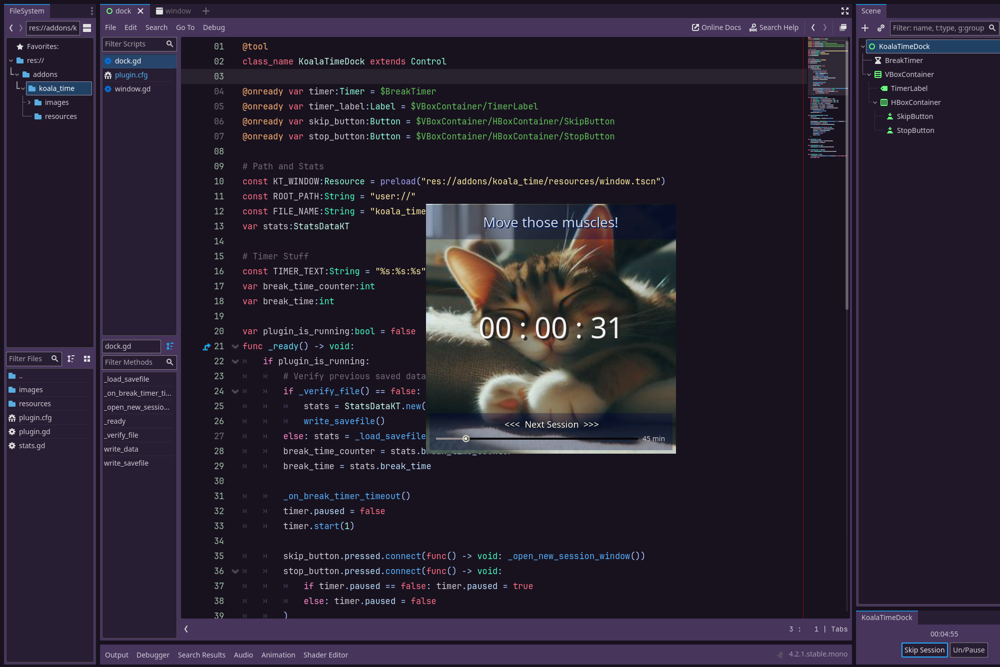

# KoalaTime_Take-A-Break

## Overview

Structure your work time and take a well-deserved break once in a while.

Work time is over! You get a cute image and a fun message to go along with it! It's up to you to decide when to launch your next work session! Increase or decrease your work time as you see fit!

Want to [display your own png files](#display-your-own-png-files)!?



## TODO / What I want to do
- _No pending tasks_

## Installation

### AssetLib

1. Launch Godot Engine 4.X
2. Open the AssetLib Tab
3. Search for 'KoalaTime' (that should bring up the plugin)
4. Download and Install my plugin
5. From the `res://` directory delete or move the addons LICENSE.md to a designated folder
6. Enable the plugin in `Project Settings | Plugins`

### Manual

1. Download the plugin as a zip file
2. Create an `addons` directory in your Godot project
3. Inside of the `addons` directory create an `koala_time` directory
4. Copy/Paste all files from the zip's `addons/koala_time` directory into the equivalent projects folder
5. Enable the plugin in `Project Settings | Plugins`

Your Godot directory structure should look like this:

```
res://
	addons
		koala_time
			...all the koala_time coding files...
```

## Display your own png files

Under the images folder ...

```
res://
	addons
		koala_time
			...other files and folders...
			images
```

... copy and paste you own **png** files! You can create any amount of subfolders (subsub ... subfolders) to structure your images **inside** the images directory.

**Hope you like it!**

## About me

#### Cuppixx

Hey there, the name is Cuppixx (not my real name, obviously). I like to do game dev stuff, primarily working with Godot Engine.

Currently I have no (active) social media! Still want to follow me? --> Check out my (very much inactive) [Twitch](https://www.twitch.tv/cuppixd)!

## Bibliography

Check out and download the amazing [Godot Engine](https://godotengine.org/download)!

### Cuppixx

[Twitch](https://www.twitch.tv/cuppixd)

[RidiculousCodingCuppixxVersion](https://github.com/Cuppixx/RidiculousCodingCuppixxVersion/tree/main)

[KoalaTime_Take_A_Break](https://github.com/Cuppixx/KoalaTime_Take-A-Break)

[PandaTime_Take_A_Break](https://github.com/Cuppixx/PandaTime_Take-A-Break)

More fun links to come ....

### Reference and Template Sources

| Authors    | Resources   |
| ---------- | ----------- |
| chukusuccess -Chuku Success-     | [Coding-Break-Extension](https://github.com/chukusuccess/Coding-Break-Extension) |
